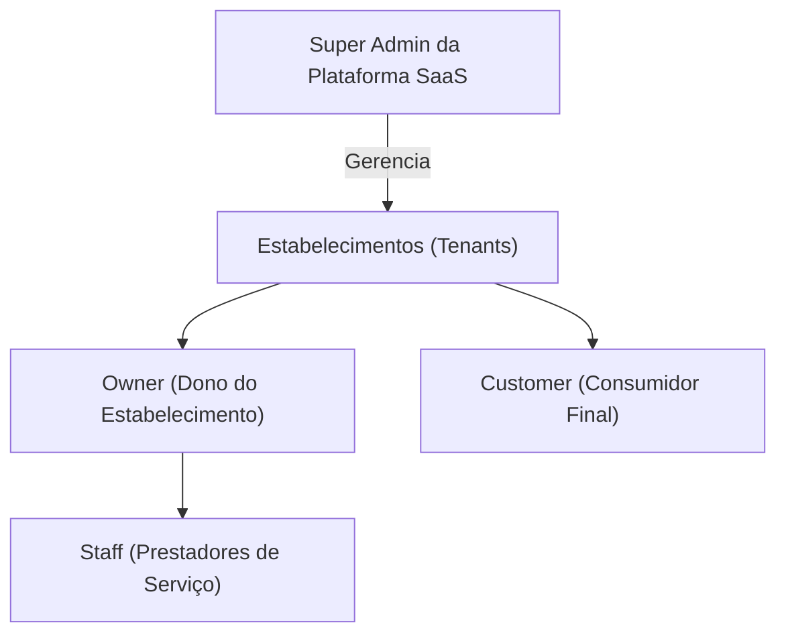
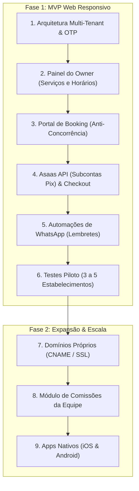

# Especificação Executiva: SaaS Multi-Tenant de Agendamento e Pagamento de Serviços

> **Status:** Especificação Consolidada (Rodada 3 finalizada)  
> **Última atualização:** 17 de setembro de 2026  
> **Modelo de Negócio:** B2B SaaS Recorrente (Stripe Billing na conta do SaaS) + B2C Serviços via Subcontas Invisíveis (Asaas Pix/Cartão)  
> **Modelo de Distribuição:** Portais Dedicados (Slug padrão e Domínio Próprio Customizado)  
> **Plataforma MVP:** Web App Responsivo Mobile-First com RBAC (Owner, Staff, Customer)  
> **Autenticação de Clientes:** Fricção Mínima via WhatsApp OTP (Passwordless)

---

## 1. Sumário Executivo e Proposta de Valor
Plataforma SaaS multi-tenant criada para centralizar e digitalizar a gestão operacional e financeira de prestadores de serviços locais (salões de beleza, barbearias, petshops, clínicas estéticas, lava-rápidos, etc.).

O sistema elimina atritos de agendamento, combate a taxa de no-show (faltas) através de pagamentos e sinais online, automatiza a comunicação prévia via WhatsApp e proporciona a cada estabelecimento um canal próprio de vendas e agendamentos.

---

## 2. Personas e Papéis de Usuário (RBAC)

O sistema possui 4 papéis com permissões e interfaces distintas:

### 2.1. Super Admin (Gestão da Plataforma)
- Painel global para visualizar todos os tenants cadastrados, faturamento de assinaturas B2B via Stripe Billing e métricas de uso.
- Gestão de planos, suporte e monitoramento do status das subcontas Asaas dos parceiros.

### 2.2. Owner (Proprietário do Tenant)
- **Configurações da Empresa:** Logo, endereço, horários de expediente, políticas de cancelamento e no-show.
- **Onboarding Financeiro Simplificado:** Fricção zero — o dono apenas informa seu `CPF ou CNPJ` e a `Chave Pix` bancária onde deseja receber o dinheiro dos atendimentos. Nenhuma conta externa em inglês precisa ser criada manualmente por ele.
- **Catálogo de Serviços:** Criação de serviços, definição de duração, intervalo entre atendimentos (*buffer*), preço e modalidade de cobrança (100% online, sinal/depósito ou pagamento no local).
- **Gestão de Equipe:** Cadastro de membros da equipe (Staff), definição de jornadas e atribuição de serviços.
- **Endereço do Portal:** Configuração do *slug* (`bomhorario.com.br/empresa`) ou configuração guiada de *domínio próprio* (`www.empresa.com.br`).
- **Dashboard Operacional:** Faturamento diário/mensal, taxa de ocupação dos prestadores e lista de agendamentos.

### 2.3. Staff (Colaborador / Prestador de Serviço)
- **Área do Prestador (Mobile-First):** Interface simplificada focada no dia a dia.
- **Gestão da Agenda Pessoal:** Visualização de atendimentos do dia/semana com status (Confirmado, Pago, Pendente, Finalizado).
- **Bloqueio de Horários:** Capacidade de criar bloqueios pontuais (almoço, folga, emergência).
- **Notificações:** Alertas em tempo real via WhatsApp e Web Push para novos agendamentos e cancelamentos.

### 2.4. Customer (Consumidor Final)
- **Portal de Agendamento do Estabelecimento:**
  - Sem atrito: Seleciona serviço -> escolhe profissional (ou "qualquer um") -> seleciona dia/horário disponível.
- **Autenticação Fricção Zero (Passwordless):**
  - Informa apenas **Nome + Número de WhatsApp**.
  - Validação instantânea via código temporário (**OTP via WhatsApp**).
  - A conta do cliente é provisionada automaticamente no primeiro acesso sem necessidade de criar senha.
- **Área do Cliente:** Acesso para consultar agendamentos futuros, cancelar (dentro da política do estabelecimento) ou remarcar.

---

## 3. Arquitetura Financeira Híbrida e Conformidade Fiscal

### 3.1. Assinatura B2B da Plataforma (Stripe Billing Direto)
- **Operação Descomplicada:** O SaaS utiliza uma única conta corporativa no **Stripe Billing**.
- **Sem Stripe Connect:** O dono do estabelecimento não precisa ter conta no Stripe. Ele apenas insere o cartão de crédito (ou boleto/Pix) para pagar a mensalidade do seu software.
- **Recorrência Automatizada:** Gestão de planos, períodos de teste (Trial), faturas e suspensão graciosa de inadimplentes.

### 3.2. Pagamentos B2C dos Serviços (Asaas Subcontas & Split Nativo)
- **Fricção Zero para o Parceiro Local:**
  - O sistema cria via API do Asaas uma **subconta vinculada ao CPF/CNPJ do estabelecimento**.
  - O dono do salão não precisa acessar o painel do Asaas. Ele visualiza seu saldo e extrato diretamente dentro do seu SaaS.
  - O repasse do valor dos serviços é enviado para a Chave Pix cadastrada do estabelecimento (de forma automática diária ou mediante solicitação de saque).
- **Blindagem Fiscal perante a Receita Federal (Sem Risco de Bitributação):**
  - O Asaas é uma Instituição de Pagamento regulamentada pelo Banco Central (Bacen).
  - Perante as obrigações acessórias da Receita Federal (e-Financeira e DIMP), o Asaas registra que o recebedor do pagamento do serviço (ex.: R$ 50 do corte) é o **CPF/CNPJ do estabelecimento (subconta)**, e não a sua empresa de software.
  - Sua empresa de software emite Nota Fiscal de Serviços (NFS-e) **exclusivamente sobre o valor da mensalidade B2B** (e de eventuais taxas de intermediação de software), sem tributar o faturamento dos cortes de cabelo ou banhos de petshop.
- **Flexibilidade de Cobrança do Serviço (Configurável pelo Owner):**
  1. *Pagamento Integral Antecipado (Pix / Cartão):* Garantia total de receita antes do comparecimento.
  2. *Sinal de Reserva (Garantia contra No-Show):* Cobrança de valor fixo ou percentual antecipado via Pix imediato.
  3. *Pagamento no Estabelecimento:* Reserva confirmada com pagamento direto no balcão físico.

---

## 4. Comunicação e Automação de WhatsApp

A comunicação via WhatsApp é o motor principal de engajamento e combate ao no-show:
- **Autenticação OTP:** Envio do código de verificação de 6 dígitos no ato da reserva.
- **Confirmação Imediata:** Resumo do agendamento (Data, Hora, Profissional, Localização no Google Maps).
- **Lembretes Preventivos Automáticos:**
  - **D-1 (24 horas antes):** Mensagem de lembrete com botão de confirmação de presença.
  - **H-2 (2 horas antes):** Alerta rápido de proximidade do horário.
- **Avisos de Cancelamento e Reagendamento:** Notificação imediata para cliente e prestador.

---

## 5. White-Label, Identidade Visual e Endereçamento

### 5.1. Customização Visual do Portal (Branding do Estabelecimento)
Cada estabelecimento pode ter a cara da sua marca no portal de agendamento:
- **Upload de Logo:** Upload de imagem (PNG/JPG/SVG) exibida no topo do portal e nos comprovantes digitais.
- **Customização de Cores:**
  - Cor Primária (botões de ação, destaque de horários selecionados).
  - Cor Secundária (badges, detalhes e elementos de apoio).
  - Cor de Fundo / Background (suporte a modo escuro ou claro).
- **Presets de Temas Prontos (1-clique):**
  - *Classic Barber:* Tons escuros, preto fosco, dourado/âmbar.
  - *Beauty & Spa:* Tons pastel, rosé, bege e branco minimalista.
  - *Pet Friendly:* Tons de azul celeste, verde menta e amarelo vibrante.
  - *Auto Detail / Lavacar:* Grafite escuro, azul metálico e vermelho esportivo.

### 5.2. Endereçamento e Roteamento Dedicado
1. **Slug Padrão (Incluso em todos os planos):**
   - Rota: `https://app.bomhorario.com.br/[slug-do-tenant]`
   - Exemplo: `https://app.bomhorario.com.br/carlosbarber`
2. **Domínio Próprio / Custom Domain (Plano Pro):**
   - Formato: `https://www.carlosbarber.com.br` ou `https://agendamento.carlosbarber.com.br`
   - O cliente insere um registro DNS `CNAME` apontando para o proxy/edge do SaaS.
   - Emissão de certificado SSL automática e gratuita via Cloudflare for SaaS ou Vercel Domains.

---

## 6. Modelo de Precificação B2B e Estratégia de Trial

### 6.1. Estrutura de Planos Populares (Cobrança via Stripe Billing)

| Plano | Preço Sugerido | Público-Alvo | Principais Recursos |
| :--- | :--- | :--- | :--- |
| **Solo** | **R$ 39,90 / mês** | Profissional autônomo individual | • 1 Usuário / 1 Agenda • Link exclusivo (`bomhorario.com.br/seunome`) • Agendamentos ilimitados • Lembretes automáticos via WhatsApp • Recebimento via Pix antecipado com subconta Asaas |
| **Equipe** | **R$ 79,90 / mês** | Pequenos salões e petshops (2 a 4 profissionais) | • Até 4 Agendas de colaboradores • Painel do Dono + Acesso para cada prestador • Controle de horários e folgas individuais • Relatório de faturamento diário • Customização de logo e cores |
| **Pro** | **R$ 139,90 / mês** | Negócios consolidados (5+ profissionais) | • Colaboradores e agendas ilimitadas • **Domínio Próprio** (`www.seusalao.com.br`) • Módulo de comissões da equipe (Fase 2) • Prioridade em suporte e atendimento |

### 6.2. Estratégia de Experimentação: Trial Baseado em Valor (10 Primeiros Agendamentos)
- **Como Funciona:** Em vez de um prazo arbitrário de dias (onde o usuário poderia esquecer o software parado), o período de testes gratuito dura até o estabelecimento completar os seus **primeiros 10 agendamentos reais**.
- **Impacto no Negócio (Product-Led Growth):** O dono do estabelecimento só é convidado a assinar a mensalidade após **comprovar o valor prático** da ferramenta com clientes reais atendidos e pagamentos recebidos.
- **Transição Suave:** Ao atingir o 8º agendamento, o sistema emite um alerta amigável no painel convidando o Owner a escolher seu plano para não interromper os agendamentos futuros.

---

## 7. Stack Tecnológica Recomendada para o MVP

| Camada | Tecnologia Recomendada | Justificativa Executiva |
| :--- | :--- | :--- |
| **Frontend & SSR** | **Next.js (React / TypeScript)** com Tailwind CSS | Responsividade total mobile-first, injeção dinâmica de CSS variables para temas customizados do salão e roteamento de domínios. |
| **Backend & API** | **Next.js API Routes / Server Actions** ou **Node.js (Fastify/NestJS)** | Alta velocidade de desenvolvimento, integração fluida e tipagem ponta a ponta com TypeScript. |
| **Banco de Dados** | **PostgreSQL** com Multi-Tenant via RLS (*Row Level Security*) | Isolamento seguro por `tenant_id`, robustez relacional para tratamento de concorrência e integridade de horários. |
| **Mensageria WhatsApp** | **API Oficial WhatsApp Cloud API** (ou Gateway Z-API / Evolution API) | Entrega confiável de OTPs e lembretes com templates aprovados pela Meta. |
| **Processamento de Pagamento** | **Stripe Billing** (Recorrência B2B SaaS) + **Asaas API** (Subcontas B2C Pix/Cartão) | Gestão de assinaturas global no Stripe e liquidação ágil com split e Pix nativo brasileiro no Asaas. |
| **Infraestrutura e Deploy** | **Vercel / Supabase** ou **AWS / Railway** | Facilidade extrema de provisionar certificados SSL para domínios customizados e escalabilidade elástica. |

---

## 8. Roadmap Executivo de Lançamento

| Fase | Entrega / Módulo | Duração Estimada | Dependência |
| :--- | :--- | :--- | :--- |
| **Fase 1 (MVP)** | Arquitetura Multi-tenant & Autenticação OTP | 15 dias | Início |
| **Fase 1 (MVP)** | Painel do Proprietário, Serviços e Grade de Horários | 15 dias | Multi-tenant |
| **Fase 1 (MVP)** | Portal de Booking e Prevenção de Concorrência | 12 dias | Painel do Dono |
| **Fase 1 (MVP)** | Integração Asaas (Subcontas Pix) & Checkout Configurável | 14 dias | Portal de Booking |
| **Fase 1 (MVP)** | Automação de WhatsApp (Confirmações e Lembretes) | 10 dias | Integração Asaas |
| **Fase 1 (MVP)** | Testes Piloto com 3 a 5 Estabelecimentos Reais | 14 dias | Automação WhatsApp |
| **Fase 2 (Expansão)** | Domínio Customizado (CNAME / SSL Automático) | 10 dias | Piloto Concluído |
| **Fase 2 (Expansão)** | Módulo de Comissões e Repasses Internos | 15 dias | Piloto Concluído |
| **Fase 2 (Expansão)** | Aplicativo Mobile Nativo (iOS e Android) | 30 dias | Módulo Comissões |

---

## 9. Diretrizes e Regras de Negócio Críticas
1. **Garantia Anti-Concorrência (Atomic Slot Reservation):** Ao selecionar um horário e ir para a tela de pagamento, o sistema deve reservar o slot por 10 minutos (*soft lock*). Se o pagamento expirar ou for abandonado, o slot retorna imediatamente para a disponibilidade geral.
2. **Onboarding sem Fricção:** O dono do salão deve conseguir configurar expediente, cadastrar 1 serviço e gerar o link do seu WhatsApp em menos de 10 minutos.
3. **Privacidade e LGPD:** Dados de clientes de um salão não podem, sob nenhuma hipótese, ser cruzados ou visíveis para outro salão.
